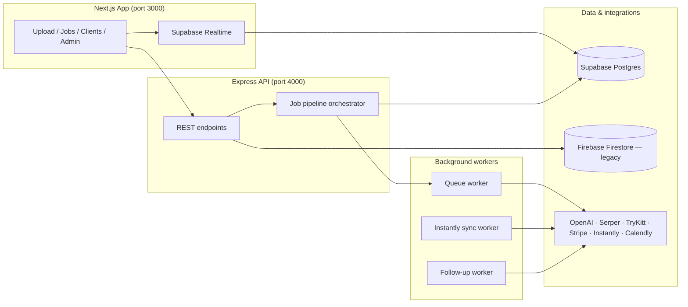

# Shields Outbound — High-Level Overview

**Shields Outbound** is an automated lead generation and enrichment platform built for outbound sales campaigns. Agencies upload lists of company domains, run them through a multi-stage enrichment pipeline, and get back verified contacts with personalized outreach copy — then push those leads into email campaigns and manage replies.

---

## What problem it solves

Outbound teams typically need to manually research founders, find emails, verify deliverability, and write personalized first lines. Shields Outbound automates that end-to-end: upload a CSV of domains, wait for the pipeline to run, export or upload enriched leads to a campaign tool like Instantly.

---

## Architecture at a glance

The app is split into three runnable processes locally (`npm run dev:all`):

| Process | Role |
|---|---|
| **Next.js frontend** | UI, auth, real-time job progress |
| **Express server** | API, job creation, webhooks |
| **Queue worker** | Runs pipeline jobs in child processes |

Additional workers handle Instantly campaign sync and scheduled follow-ups.

---

## Core workflow: the enrichment pipeline

1. **Upload** — User uploads a CSV of domains for a client.
2. **Deduplicate** — Previously processed domains can be skipped or tracked.
3. **Run pipeline** — Four sequential stages, each writing intermediate CSVs:

| Stage | What it does | External APIs |
|---|---|---|
| **Founder discovery** | Finds CEO/founder name from web search | Serper + OpenAI |
| **Email discovery** | Looks up email for the founder | TryKitt |
| **Email verification** | Validates deliverability | TryKitt |
| **Personalization** | Generates a personalized first line | OpenAI + scraping (niche-specific) |

4. **Export / upload** — Results land in Postgres as leads and can be downloaded or pushed to a campaign.

Personalization strategies vary by **niche** (e-commerce, SaaS, agency, local). The e-commerce path is the most involved — Shopify detection, product scraping, then AI-generated copy.

Progress is pushed to the UI live via **Supabase Realtime** on the `jobs` table.

---

## Beyond the pipeline

The platform has grown into a fuller outbound operations tool:

- **Multi-tenant clients** — Agencies manage multiple clients, each with their own leads, jobs, and API keys.
- **Instantly integration** — Syncs campaign data, tracks reply/event analytics, and supports uploading enriched leads.
- **Interested autoresponder** — Handles positive replies with draft responses (token-based public page at `/interested-autoresponder/[token]`).
- **Follow-up sender** — Scheduled follow-up emails via a dedicated worker.
- **Calendly webhooks** — Meeting-booked events tied into the lead timeline.
- **Stripe billing** — Per-stage cost tracking and checkout.
- **Platform admin** — `/admin` for creating/managing agency accounts.

---

## Main UI surfaces

| Route | Purpose |
|---|---|
| `/` | Create pipeline jobs, manage API key vault |
| `/clients` | List clients |
| `/clients/[clientId]` | Primary workspace — leads, active jobs, campaigns, Instantly analytics |
| `/account` | Account settings |
| `/auth` | Sign in (Supabase Auth) |
| `/admin` | Platform admin (agency provisioning) |

---

## Tech stack

- **Frontend:** Next.js 16, React 19, TypeScript, Tailwind v4, shadcn/ui, Recharts
- **Backend:** Express, Node.js (ES modules), csv-parse/stringify
- **Database:** Supabase Postgres (jobs, leads, contacts, analytics) — migrated from an earlier Cloud SQL + Firestore setup; some Firestore usage remains for legacy data (e.g. API keys)
- **Auth:** Supabase Auth on the frontend; backend verifies tokens and maps users to `agency_id`
- **Realtime:** Supabase `postgres_changes` subscriptions
- **External services:** OpenAI, Serper, TryKitt, Stripe, Instantly, Calendly

---

## Data model (conceptually)

- **Agency** — A signed-in user/organization (the tenant).
- **Client** — A customer the agency runs campaigns for.
- **Job** — A single pipeline run (stages, status, cost, progress).
- **Lead** — One domain with enrichment fields (founder, email, personalization, etc.).
- **Campaign / Instantly sync** — Outbound email campaign state and event analytics.

Temporary CSV artifacts for each job live on disk under `server/tmp/jobs/{jobId}/`.

---

## In one sentence

Shields Outbound is a **B2B outbound ops platform** that turns raw domain lists into verified, personalized leads — with live pipeline monitoring, campaign tooling (Instantly), reply handling, and billing — built as a Next.js + Express monorepo backed by Supabase Postgres.

---

For setup, API endpoints, and operational details, see [README.md](./README.md).
